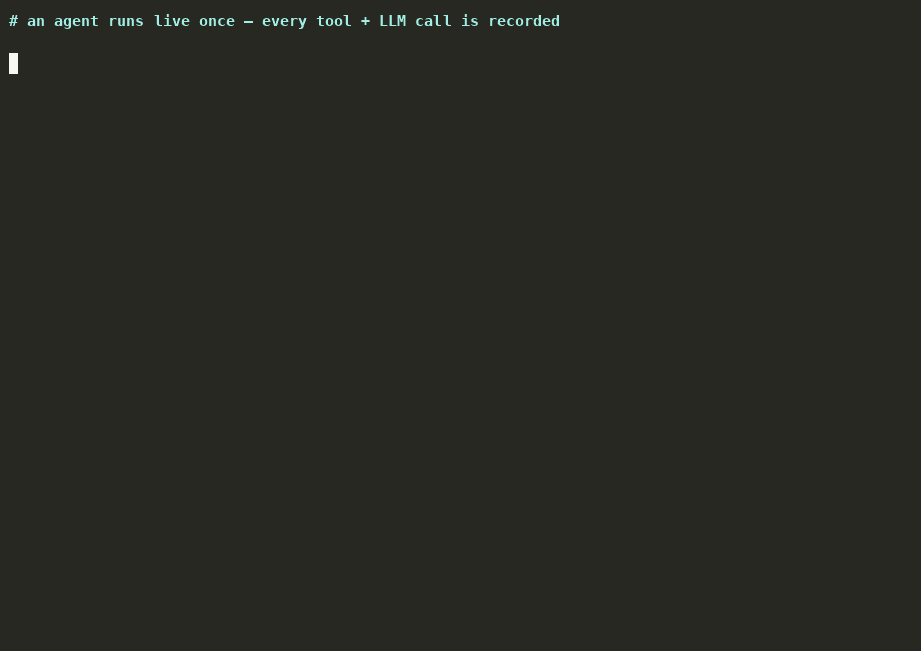

<div align="center">

# 🧊 dagcache

**Record your AI agent once. Replay it on every repeat task.**

Agents waste time and money re-planning tasks they've already solved.
dagcache watches an agent run, remembers the steps it took, and replays those
steps the next time a similar task comes in — the LLM only gets called for
genuinely new situations.

[](https://pypi.org/project/dagcache/)
[](https://www.python.org/)
[](LICENSE)
[](pyproject.toml)



</div>

---

## 💡 The idea

Workflow tools like [Luigi](https://github.com/spotify/luigi) make you write
out the whole workflow up front. dagcache flips that around: it **watches your
agent work and learns the workflow on its own**. Once a way of solving a task
proves it works, dagcache saves it and reuses it — like
[VCR](https://github.com/vcr/vcr) cassettes, but for agent behavior instead of
HTTP.

```
run agent once  ──▶  save the steps it took  ──▶  approve the winning route
                                                        │
        similar task comes in  ──▶  replay the steps (no planning LLM call)
                                                        │
        something changed in the world?  ──▶  fall back to the live agent
```

## 🚀 Install

```bash
pip install dagcache        # zero runtime dependencies
```

## ⚡ Quickstart

```python
import dagcache

@dagcache.tool(pure=True)            # read-only: safe to skip in frozen replay
def search_kb(query: str) -> str: ...

@dagcache.tool(pure=False)           # has side effects: always runs for real
def send_reply(ticket_id: str, body: str) -> str: ...

@dagcache.llm(planning=True)         # decides what to do: skipped on replay
def plan(prompt: str) -> str: ...

@dagcache.llm                        # writes user-facing text: runs fresh
def draft(prompt: str) -> str: ...

@dagcache.agent
def resolve_ticket(ticket: dict) -> str:
    plan(f"handle {ticket['title']}")
    article = search_kb(ticket["title"])
    order = fetch_order(ticket["order_id"])
    send_reply(ticket["id"], f"see {article}")
    return draft(f"article={article}; status={order['status']}")
```

| Run | What happens |
|---|---|
| **Run 1** 🎬 | The agent runs normally. dagcache records the steps it took (`search_kb > fetch_order > send_reply`, plus the LLM calls) into `.dagcache/store.db`. |
| **Run 2** 🔁 | A new ticket of the same *shape* comes in. dagcache replays the saved steps: tools run again, but with values taken from the **new** ticket (e.g. its `order_id`), the planning LLM is never called, and the final reply is written fresh using the new data. |
| **Run 3** 🌍 | The world changed (a tool returns something unexpected, a value is missing, a tool crashes). Replay stops and the live agent takes over automatically. **Worst case, dagcache behaves exactly like your agent does today.** |

▶️ **Try it:** `python examples/ticket_agent.py`

## 🧠 What gets saved, exactly

dagcache doesn't cache answers — it caches **the plan**. Two things decide
whether a saved plan applies:

1. **which task it is** (the `@agent` function), and
2. **the shape of the inputs** (their types and field names — never the
   actual values).

The saved plan is a graph of steps. Each step's arguments are stored as
references, not fixed values:

| Reference type | What it means at replay |
|---|---|
| `input` | take it from the new task's input (e.g. `ticket.title`) |
| `node`  | take it from an earlier step's **fresh** result (e.g. `n1.order_id`) |
| `literal` | a value the LLM made up; reused as-is (with old→new values swapped in) |

If the agent finds two different ways to solve the same kind of task, both are
kept and ranked by how often they work. `dagcache approve` locks in the
winner. A saved plan that keeps failing is dropped after 3 failures.

## 🔁 Replay modes

- **verified** *(default)* — tools run for real with fresh values (real side
  effects, fresh data), planning LLM calls are skipped, text-writing LLM
  calls run again. Think of it as [Luigi](https://github.com/spotify/luigi)'s
  worker, where the learned plan is the workflow.
- **frozen** — nothing runs; recorded results are returned as-is. Like
  Luigi's `output().exists()` across the whole graph —
  [VCR](https://github.com/vcr/vcr) mode, great for tests and CI.

```python
dagcache.configure(db_path=".dagcache/store.db", replay_mode="frozen")
# or env: DAGCACHE_MODE=record|off, DAGCACHE_REPLAY=verified|frozen, DAGCACHE_DB=...
```

Two tasks can have the same input *shape* but mean different things (a refund
ticket vs. a complaint). Give the agent a discriminator — its value becomes
part of what makes a task unique:

```python
@dagcache.agent(key=lambda ticket: ticket["category"])
```

## 🛠 CLI

```bash
dagcache ls                    # id, status, recordings, hits, failures, steps
dagcache show 3                # full plan JSON
dagcache approve 3             # lock in the winning route
dagcache demote 3              # back to probation
dagcache diff 3 7              # compare two candidate routes
dagcache export 3 -o c.json    # save a cassette for code review
dagcache import c.json
dagcache prune --status dead --older-than 30
```

## 🔌 Framework integrations

**[OpenAI](https://github.com/openai/openai-python)** (duck-typed — works with
any `.chat.completions.create` client):

```python
from dagcache.adapters.openai import wrap_client
client = wrap_client(OpenAI())   # role="auto"|"planning"|"output"
```

Responses containing `tool_calls` are treated as planning (skipped on
replay); text responses as output writing (run again on replay, with the
prompt updated to fresh data).

**[LangChain](https://github.com/langchain-ai/langchain)** (duck-typed — no
langchain import required):

```python
from dagcache.adapters.langchain import wrap_tools, wrap_llm
agent = build_agent(llm=wrap_llm(ChatOpenAI(...)), tools=wrap_tools([...]))
```

## ⚠️ Honest limitations

- **Matching is exact, not "similar".** A saved plan only applies when the
  task type, input shape, and key all match exactly. Fuzzy/embedding matching
  is deliberately not in v0.1 — a "close enough" match replaying a path with
  real side effects is how the cache refunds the wrong customer.
- **Side effects really happen.** Verified replay runs effectful tools for
  real. That's automation, not caching. Mark them `pure=False` and keep fuzzy
  matching off.
- **Made-up values can go stale.** If the LLM invented a value that came from
  neither the inputs nor tool results (e.g. a date it guessed), it's replayed
  verbatim. Change detection only checks the *shape* of results.
- **Prompt updating is a heuristic**: old→new value substitution with
  word-boundary matching. A value that changed but still *looks* the same
  (e.g. a price) is not detected.
- **The agent function must return its final call's result.** Custom
  post-processing after the last LLM/tool call won't run on replay.
- **Cache poisoning is a thing**: if agent inputs are attacker-controlled,
  keep a separate store per principal and `approve` plans before production.

## 💎 Ruby

A [RubyLLM](https://github.com/crmne/ruby_llm) plugin on the same mental
model lives in the companion repo
**[`ruby_llm-dagcache`](https://github.com/itstheraj/ruby_llm-dagcache)** —
YAML cassettes, `DagCache.watch(agent)`, automatic `RubyLLM::Tool`
instrumentation.

## 📚 Prior art

- [Agentic Plan Caching (arXiv 2506.14852)](https://arxiv.org/abs/2506.14852)
  — research prototype; still spends an LLM call adapting templates.
- [Agent Workflow Memory (arXiv 2409.07429)](https://arxiv.org/abs/2409.07429)
  — injects past workflows into prompts; doesn't skip the agent.
- [GPTCache](https://github.com/zilliztech/GPTCache) / [LangChain](https://github.com/langchain-ai/langchain)
  caches — cache single LLM calls by semantic similarity.
- [LangGraph](https://github.com/langchain-ai/langgraph) checkpointing /
  [Temporal](https://github.com/temporalio/temporal) — resume interrupted
  runs, not reuse across tasks.
- [vcrpy](https://github.com/kevin1024/vcrpy) / [VCR](https://github.com/vcr/vcr)
  — the right mental model, at the wrong layer.

## 📄 License

[MIT](LICENSE) © dagcache contributors
